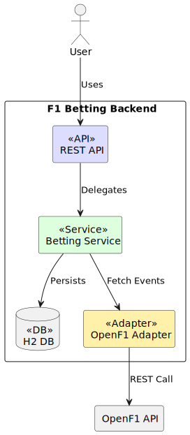
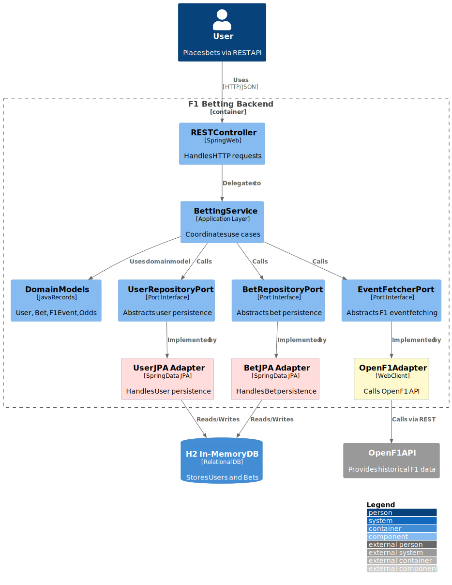
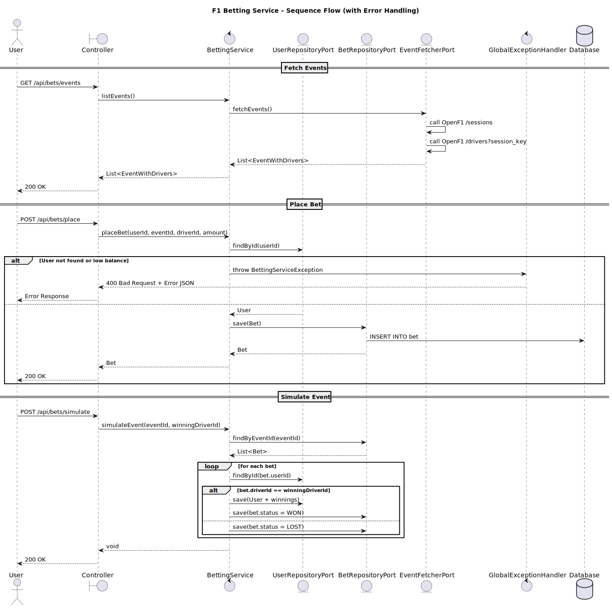

# 🏎️ F1 Betting Backend – Hexagonal Architecture

A cleanly architected Spring Boot 3.x backend service that enables users to bet on F1 events, simulates outcomes, and integrates with the OpenF1 API using Java 17 features.

---

## ⚙️ Tech Stack

- Java 17
- Spring Boot 3.3
- Spring Web + WebFlux (WebClient)
- Spring Data JPA (H2)
- OpenF1 API (https://openf1.org)
- Swagger/OpenAPI 3
- Maven

---

## 🧱 Architecture & Design

### ✅ Hexagonal (Ports & Adapters)


### ✅ C4 Context

- Users interact with `/api/bets/...`
- Backend calls OpenF1 to fetch sessions and drivers
- Bets are stored locally in DB
- Simulation changes bet state and updates user balance



### ✅ C4 Container



### Sequence Diagram



---

## 📐 Design Patterns Used

| Pattern               | Purpose                                  |
|----------------------|------------------------------------------|
| Hexagonal             | Separates domain from infrastructure    |
| Port & Adapter        | Enables replaceable integrations        |
| Repository            | Abstract DB access                      |
| Strategy (future)     | Flexible betting outcome simulation     |
| Exception Handling    | Unified global error responses          |
| DTO Pattern           | Separation of concerns (API vs domain)  |

---

## 🚀 How to Run

```bash
mvn clean
mvn verify
mvn spring-boot:run 
# (or run it through your IDE)
```
### 🛠️ Prerequisites

#### Health check 
```shell
curl http://localhost:8080/management/health
```
#### swagger-ui
```shell
http://localhost:8080/swagger-ui.html
```
#### DB H2 Console

```shell
http://localhost:8080/h2-console
```
#### default users

| Default User         | UUID                                   | Balance   |
|----------------------|----------------------------------------|-----------|
| Default User 1       | 11111111-1111-1111-1111-111111111111   | €100      |
| Default User 2       | 22222222-2222-2222-2222-222222222222   | €100      |
| Default User 3       | 33333333-3333-3333-3333-333333333333   | €100      |

## 🧪 API Execution Examples

### 📬 get all events

> **Note:** This endpoint fetches events directly from the OpenF1 API without caching and allows all results, which may lead to slow response times. For faster results, filter by specific `year`, `country`, and `sessionType`.

```bash
curl -X 'GET' \
  'http://localhost:8080/api/bets/events?sessionType=Race&year=2023&country=Belgium' \
  -H 'accept: */*'
```
### 📥 place a bet
```bash
curl -X 'POST' \
  'http://localhost:8080/api/bets/place' \
  -H 'accept: */*' \
  -H 'Content-Type: application/json' \
  -d '{
  "userId": "11111111-1111-1111-1111-111111111111",
  "eventId": "9a4e1231-abe9-42a8-ae85-f88d3dbb3c29",
  "driverId": "a6efc71c-384f-3cb0-8f2c-6d0d82e754fe",
  "amount": 50
}'
```
### 🔁 Simulate a bet outcome
```bash
curl -X 'POST' \
  'http://localhost:8080/api/bets/simulate' \
  -H 'accept: */*' \
  -H 'Content-Type: application/json' \
  -d '{
  "eventId": "9a4e1231-abe9-42a8-ae85-f88d3dbb3c29",
  "winningDriverId": "a6efc71c-384f-3cb0-8f2c-6d0d82e754fe"
}'

```

## ✅ Next Roadmap
- [x] Improvise `fetchEvents` (`/sessions`) api with pagination
- [x] Proper logging interceptors
- [x] Add more relevant tests
- [x] Add more relevant exceptions and handling scenarios
- [x] code coverage - sonar aiming ot get 80%
- [x] Dockerized
- [x] Cache
- [x] DB Interaction like Postgres
- [x] CI/CD with GitHub Actions
- [x] Scalability and performance improvements (e.g. async processing, event-driven architecture)
